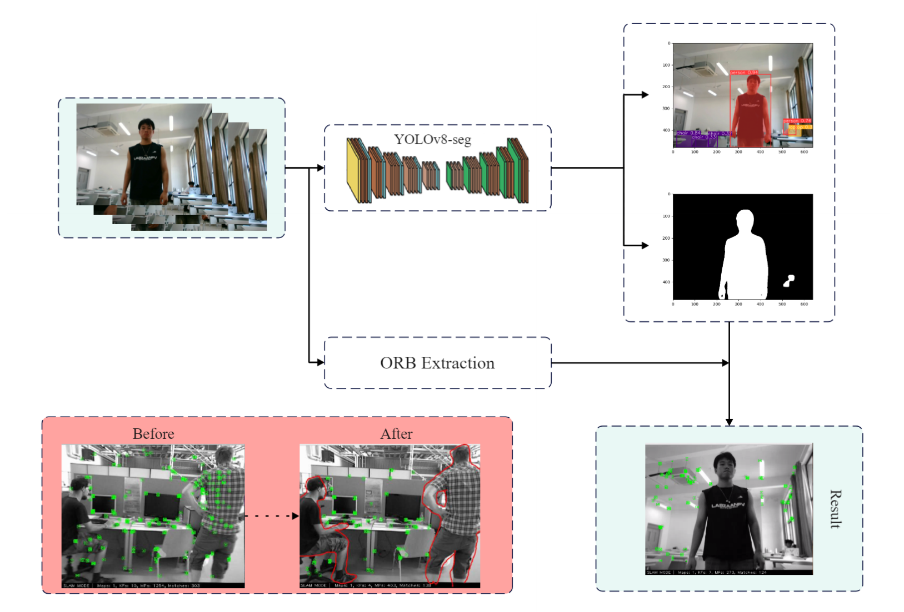
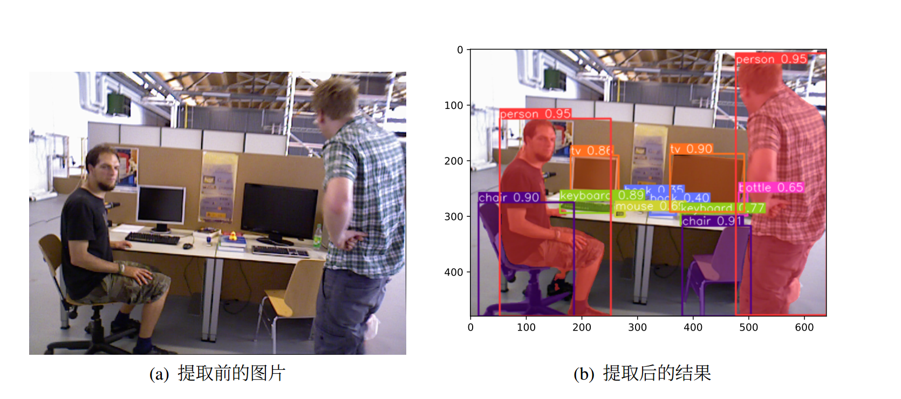
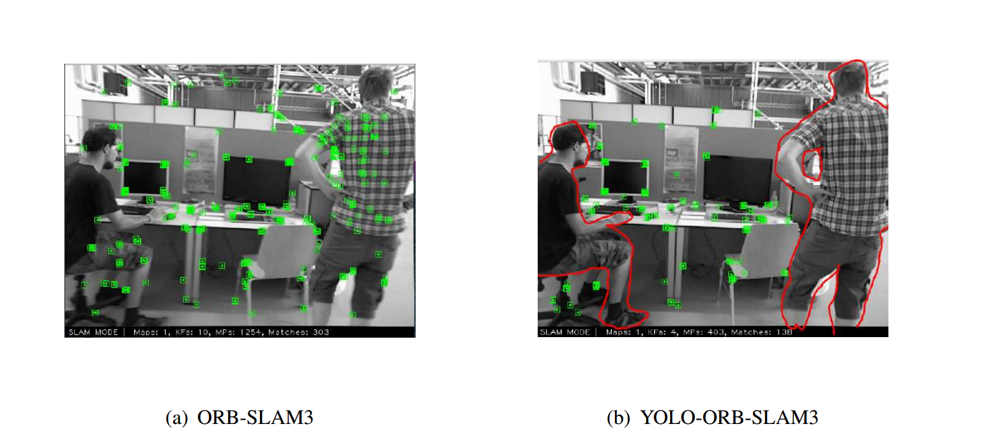

# YOLOv8-ORB-SLAM3
YOLOv8-ORB-SLAM3: Semantic SLAM with dynamic feature point removal

You can see the source code in the branch master. You can get it by cloning the branch master.

The branch 'main' doesn't have anything but Readme.md.
You can get the source code by git such as:

 git clone https://github.com/Glencsa/YOLOv8-ORB-SLAM3.git

 git checkout master

Our result as below:

;

segment results 
;

removal of the dynamic feature point:

;
